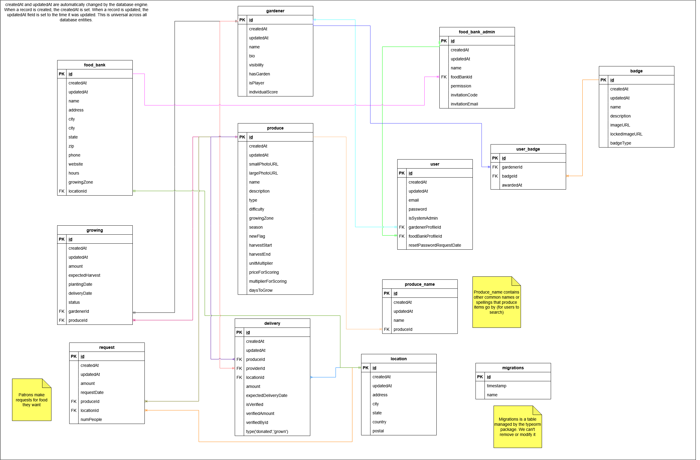

# PeoriaFresh! Backend

**A word of warning**

 Before reading further or doing any coding, create a new branch from main and use that to do your development. Any pushes or pull requests you make to the main branch will be pushed directly to production. This is the case for **both the front and back end**.

## Getting Started

NOTE: Some of this information may be a bit outdated. The FA23/SP24 team wrote out all of this information for the FA24/SP25 team to use. In order to give any adopters of our code as much information as possible, we decided to leave all of the information here. If you want more information, please check out the "Peoria Fresh - Open Sourcing Tutorial" file in the "Open-Source-Help" folder in the frontend's repository. 

Docker is the much-preferred way to begin setting up PeoriaFresh. This is because it most closely resembles the way it will be run in the production environment, but also because it offers a very easy way to install the development environment on your machine. 

Docker Desktop is an application that gives Docker containers a fancy UI that makes life much easier than the traditional command line. It also gives a fantastic way to easily get complex code like PeoriaFresh running, called DevEnvironments.

[Docker Desktop](https://www.docker.com/products/docker-desktop/)

DevEnvironments are containers themselves that integrate with Visual Studio Code. They also provide you a Linux command line directly into the environment where the code is running. To start, download Visual Studio Code (if you don't already have it), and install Docker Desktop. Create a DevEnvironment for the backend and open it in VS Code (a button will appear, giving you this option). Create a new terminal where you can execute commands in the container. Run `npm install` and then `npm start`. These should be the only two commands you need to get the backend running locally. If you only run these commands, you'll get an error that the database connection failed. For this, you'll need to create a `.env` file fom the template and fill in your database connection information. 

## Abstraction

The backend code is highly abstracted. The abstraction folder will tell you how each of the entities will behave by default. Any additional configuration you need to do is done via overrides on the inheriting entity. Fair warning, this is very annoying sometimes because the overrides sometimes aren't enough to stop the default actions from happening at some level. Deliveries are not abstracted, I had to copy the BaseController to this file and change it to what I needed it to do. 

Because it's so abstracted, there is sometimes not very much code in the inheriting entities' code files, but rest assured, things are happening. Hopefully, the non-complexity of the inheriting entities' code is enough that the code is self-explanatory. When in doubt, see the base class.

## The DB - This information is up-to-date (as of the FA24/SP25 team).

Here's the breakdown of the current schema. The image is low quality because Miro won't let us download higher resolutions for free, so, sorry in advance.



What the entities are for:
1. Request: Patrons create a need for Gardeners to fill.
2. Growing: An in-progress fulfullment of the Patrons' needs by Gardeners.
3. Delivery: A completed fulfillment of the Patrons' needs.
4. User: Someone who logs into PeoriaFresh.
5. Gardener: Someone who grows/donates food. 
6. Produce: Something a Gardener can donate and what a Patron needs.
7. Food Bank: An entity that oversees food distribution. Associated with a Location.
8. Location: Where something is (an address). Particularly where a Request came from and where a Delivery should go.
9. Food Bank Admin: A User who works with a Food Bank directly, overseeing the movement of food.
10. Produce Name: Aliases for the names of Produce (corn is also called maize, etc).
11. User Badge: Helps award badges to users.
12. Badge: Contains the information related to Badges like the images associated with it, the descripion, and name.

## The Libraries

On top of nodejs, these are some of the major frameworks/libraries that PeoriaFresh uses on the backend.
1. TypeScript
2. ExpressJS
3. TypeORM (database interaction)
4. NestJS
5. SwaggerJS
6. JWT

Based on these, if you've never heard of these before or you don't know a lot about them, it would be an excellent idea to research these topics in order to truly understand how the system works:
1. JWT: JSON Web Token (our auth tokens)
2. ORMs: Object Relational Mappers (our connection to the database)
3. How React & TSX work (our whole front-end)
4. TypeScript syntax (our whole front-end and back-end are in TypeScript)

## Structure

Under the `src/` directory, each database entity has its own dedicated directory. The following image describes the entities' relationships.
Under each directory, there are four files and another directory, {entity} replaced by the name of the entity that the files describe.
1. {entity}.controller.ts
2. {entity}.module.ts
3. {entity}.repository.ts
4. {entity}.service.ts
5. entities (directory), contains {entity}.entity.ts

* The `controller` file handles what happens when a web request is sent to the API for a specific entity. It answers the questions: "When someone wants to create a Growing, what do I do?" and "Who should be able to view Deliveries?"

* The `service` file handles specific database interactions. It answers the questions: "Which Deliveries currently exist in the database according to the specified criteria?" and "How do I actually greate a Growing in the database?"

* The `module` file is how express and nest know what to initialize and the different entities' dependencies. It answers the questions: "How I know what files to use for my entity?" and "If I want to create a Delivery when a Growing turns from 'planted' to 'harvested', where do the Delivery files live to make that happen?"

* The `repository` file ensures that other entities are able to interact with the repositories (database tables) of other entities. This is extremely important when you want to query data about other entities from within another. Such as looking up a Gardener's ID when creating a Growing. 

* The `entity` file contains TypeScript type definitions for the entity; what fields it has and how TypeORM should store that in the database. 

A bit more on repositories to avoid frustration in the future. When you're linking a repository to another entity, you need to put that repository in the module file of the entity you're accessing it from. You put it in the `providers` array. See existing files for specific examples. The Delivery entity is really good for seeing how different entities interact.

## Food Bank Admins

These are a special entity because they're allowed to verify Deliveries. If a Delivery is made to a Food Bank with a registered Location, then Food Bank Admins (FBAs for the sake of typing that over and over) can go to their dashboard page and enter the amount of food actually donated. This is designed to keep the reported amounts accurate if a Gardener decides to embellish the truth when donating. 

There are only 2 ways FBAs can be created. If the FBA is the first registered to their Food Bank, there's only one way. That way is by us directly through the MySQL command line inserting a row into the `food_bank_admin` table. This is because there should be an in-person process to getting the ball rolling for admitting Food Banks to the system because otherwise someone may try to register their own house as a food bank and expect curbside produce deliveries.

The second way FBAs can be made is by being added to a root of trust. The root is initiated by the first user being created by us, so it's kind of like a Certificate Authority delegating trust to its Intermediate CA's. There are permission levels within the FBA table. Stored as an integer so that it's expandable later, permissions are currently defined for 0, 1, and 2. 

* 2 may verify deliveries
* 1 may do what 2 can + add to the root of trust.
* 0 may do what 1 can + delete from the root of trust as well as change permission levels of other users. They should also be able to change the food bank's details.

Level 0 can basically do anything they want, except for change their own permissions level. No user can change their own permission level. If someone wants to step down as root without replacing themselves as root. 

Take the following situation. Danny no longer wants the weighty responsibility of being a level 0 admin. He must the promote Suzy to root, then Suzy will be able to demote Danny from root to another permission level. It's convoluted but ensures that there will always be at least one root user. There can be more than one, but never zero or we have to go in and bail them out.

## Locations

Locations are a traceability metric to ensure that Food Banks are able to receive food they're requesting. Locations are a collection of address components that we can use to represent a real place. If a Location doesn't exist in the database and someone requests or delivers to that address (and tell the system about it), it will add it to the Location table. The Location's ID will then be linked to any subsequent Requests, Deliveries, or Food Banks with that address so everything is joined in the middle by a Location ID.

Locations are *optional* on Requests because a Patron may not want to share that information. And if there's one thing that users of a software won't do, it's be told what to do when they don't want to do it. If we required that field, then if someone didn't want to share what food bank they're requesting from, they could put a random address to avoid the question. That helps nobody, so we'd rather know what they want and not have a specific place to send it to than to know what they want and send it to the wrong place. 

Locations are *mandatory* on Deliveries because we really want to know what's going where and this is a piece of data that the Gardeners should have no reservations about giving. Even if they don't know right away, they can fill out the information for Delivery creation retroactively after they deliver it.

## The Process

The "root" entity is the Request. All of the actions within PeoriaFresh start with a Request being made. After the Request is made, Gardeners can see its existence and choose to pledge a donation in some amount of that Produce. After they make this pledge, a Growing is created. Growings have 2 states: accepted and planted. An accepted Growing tells the system that a Gardener will plant it but hasn't yet. A planted Growing means that the is currently in the ground and growing. After the plants are ready to harvest, you `PATCH` the status to `harvested` which will create a Delivery. A Delivery is a record that this Gardener has donated this Produce to a Food Bank. 

There are some deviations from this process that are allowed. 

First, Deliveries may be made directly when making a pledge of produce to grow. This is assumed to be a Gardener having the produce already on hand and not needing to go through the Growing process (they bought it from a store, it's harvest time and has extra crops to donate, etc). 

Second, Gardeners may cancel Growings. If a frost or rabbit takes out their garden, then they should be allowed to rescind their pledge.

## Deleting Users

When a user wishes to delete their User, a couple of things happen. There's a difference between Gardeners and FBAs deleting their accounts.

Only a FBA of account level 0 can delete other FBAs. When deleting a FBA, the API requires you to submit the name of the target FBA to confirm intent to delete that user.

For Gardeners, you are required to submit the registered Gardener's email to delete their User. 

When a User is deleted, only their User is deleted. Associated Gardener and Food Bank Admin profiles are not deleted because they are referenced by Deliveries, and we want those to stick around after a User is deleted. The PII is removed from the corresponding profiles they're associated with in order to keep their privacy. Assuming there's a User ID called `uid`, the following pseudo-SQL queries convey the application logic behind it.

```sql
SELECT gardenerProfileId, foodBankAdminProfileId FROM user WHERE id = $uid;
UPDATE gardener        SET name = 'Deleted User {$uid}', bio = NULL, visibility = 'private'      WHERE id = $gardenerProfileId;
UPDATE food_bank_admin SET name = 'Deleted User {$uid}', invitationEmail = 'Deleted User {$uid}' WHERE id = $foodBankAdminProfileId;

DELETE FROM user WHERE id = $uid;
```

## Choices Made

From the 2022/23 group who initiated this project, the 23/24 group made some major modifications. Here are some of them and our reasoning.

1. Requests are not authenticated. When a Patron makes a Request for produce, those API calls do not require an access token anymore. This was to help push the usefulness of PeoriaFresh beyond the few food pantries who initially collaborated with us and thus made accounts. It used to be that a Food Bank Admin had to sign in and go to the Request page, but that is no longer required. Anybody can request produce.
2. No more Tickets. I still don't know what the actual purpose of Tickets were, but they increased the restrictiveness of the system, and a big goal for us was to make the system less restrictive so anyone can request and anyone can donate. The amount of Produce requested from a Location is determined by an aggregation now instead of adding and subtracting from a number in some row somewhere. The aggregation is as follows: `pounds requested = SUM(pounds of Requests) - SUM(pounds of Growings)`. As to keep up with current trends in food demand, the aggregation is only done with data from a maximum of one year ago.
3. Food Bank Admins are their own thing. They used to just be Users who were assigned to a Food Bank, but that didn't work when we tried to expand Food Bank Admins' capabilities, so now Users can be linked to a Food Bank Admin which is linked to a Food Bank. Just like how Users are linked to a Gardener.

## \*Known\* quirks

When you're a user that both has a Gardener and FBA profile linked, the backend has no idea who you're requesting as. For example, if you are `GET`ing as a Gardener, you're only supposed to see the Deliveries you made yourself. FBAs are only supposed to see the Deliveries made to the Food Bank they're associated with, so there's a large difference between the data the API is supposed to return for those differing user types.

The problem arises from the fact that there's no way for the backend to figure out who you're requesting as if you have both profiles on your User. We solved this problem by adding a `GET` param called `showAs` which you can either have it set to `gardener` or `food-bank-admin`. If you don't specify this and there are both profiles active, there's no telling which data you'll get on Deliveries. The main quirk here is distinguishing between user types. We haven't found any other parts of the system where this is an issue, but it doesn't mean there aren't any.

## // TODO

We (the 24/25 group) weren't able to get everything we wanted to implement into the current version of Peoria Fresh, but you might be able to!

1. Front-end ability to manage FBAs (food bank admins) from a root FBA account.
2. Ability to send preset encouraging messages or thank yous between Gardeners and Patrons via the FBAs
4. Translation options outside of Google Translate. We found out the hard way that not everyone speaks and reads English. I'm envisioning a new table with language-word pairs linked to a produce, but that's just me.
5. Team functionality for the leaderboard - We have files in the frontend (src/views/gardener/tbd-teams-folder) and backend (src/team & src/teamuser) that we started to work on but couldn't finish
6. Rewards Page (frontend)
7. Create different leaderboards on how big they can grow a vegetable (Suggestion from a gardener who watched our Capstone Presentation)
